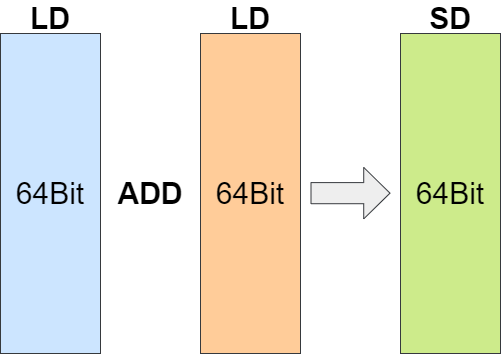
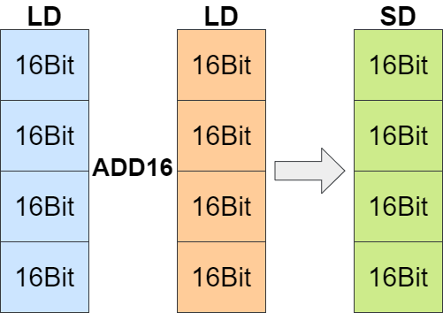

# Polaris22A: RISC-V SIMD Superscalar Dual-Issue Processor
Polaris is a sequential superscalar dual-issue RISC-V processor supporting RISC-V P instruction set extension（Packed-SIMD Instructions）

- [Polaris22A: RISC-V SIMD Superscalar Dual-Issue Processor](#polaris22a-risc-v-simd-superscalar-dual-issue-processor)
  - [0. RISC-V P instruction set extension](#0-risc-v-p-instruction-set-extension)
  - [1. Processor Features](#1-processor-features)
  - [2. Processor Architecture](#2-processor-architecture)
  - [3. Simulation and FPGA Implement](#3-simulation-and-fpga-implement)
  - [4. Configuration of Polaris](#4-configuration-of-polaris)
  - [5. About](#5-about)
<br/><br/>

## 0. RISC-V P instruction set extension
 RISC-V P instruction set extension (RVP for short) is a RISC-V instruction set extension in the draft stage. 
 RVP multiplexes the general-purpose registers specified by RVI and divides them into 8bit data groups, 16bit data groups or 32bit data groups. In this way, RVP allows cpu to process multiple sets of data in one instruction, improving parallel computing performance.





 This processor is developed according to the official manual of RVP version 0.9.11（The 32-bit version of RVP is not supported in Polaris）. The link to the official RVP manual is as follows:
 https://github.com/riscv/riscv-p-spec/blob/master/P-ext-proposal.adoc

<br/>

## 1. Processor Features
 Instruction Sets: RV64IMACP

 Privileged Mode: U/S/M

 Virtual Memmory: SV39

 Issue Num: 2(single-issue supported as well)

 Cache: 32KB DCache + 32KB ICache + 128KB L2 Cache
<br/>

## 2. Processor Architecture
 Polaris is structured as a sequential Dual-Issue Processor. It adopts the variable-length back-end structure to balance the efficiency and timing of each operator. The pipeline of the entire processor can reach up to 8 stages.


<br/><br/>


The Issue level(ISU) uses InstBoard and RegBoard to record the order of each instruction and the use of registers, completing the detection of data conflicts and the data-forward.
Up to 2 instructions can be sent to EXU from ISU per cycle.


 The EXU consists of multiple operators, including two ALUs, an MDU, a BRU (optional), a CSRU, an LSU, and a PEXTU (optional and configurable) 

 The number of instructions running in parallel within an exu is not limited by the ways of issues.


 Polaris supports RVP through a SIMD sub-component with a configurable number of issues. This component contains two-stage pipelines: Issue stage and Operation stage. The Issue stage integrates RVP decoding uint and pre-computation uint, which is responsible for sending instructions to the Operation stage. The Operation stage continues to operate on the preprocessed data and submits the final result.


<br/><br/>

## 3. Simulation and FPGA Implement
 Polaris supports simulation through verilator or verification on fpga platforms.
 To generate a emulator to simulate Polaris, one should follow the instructions of [Nutshell](https://github.com/OSCPU/NutShell) where the README descripes detailed dependencies and operations how to use provided image or other images.
-  you can use the following command to compile the emulator in the directory of this repository,The emulator(emu) will be generated in the "build" directory
- ```
    make emu EMU_TRACE=1 EMU_CXX_EXTRA_FLAGS="-DFIRST_INST_ADDRESS=0x80000000" WITH_CHISELDB=01
  ```
-  After getting the emulator, you can run your programme image with following command:
- ```
    ./build/emu -b 0 -e 0 -i ./ready-to-run/microbench.bin --no-diff
  ```
-  To obtain more parameters and usage of EMU, use the following command:
- ```
    ./build/emu -help
  ```
-  If you want to compile the RVP program for simulation and fpga, you need to use a special compilation platform: [Nexus-AM](https://github.com/ByeBeihai/nexus-am)
 
Polaris has implemented the [fpga verification environment](https://github.com/ssdfghhhhhhh/NutShell_U250) on the U250 accelerator card. It can launch linux with image: linuxshell.bin (in directory :ready-to-run) on U250.


<br/><br/>

## 4. Configuration of Polaris
 In addition to the configurable items of the NutShell(while RV32 is not supported in Polaris), Polaris also includes the following configurable items: 
-  independent BRU or BRU integrated in ALU(1 or 0)
-  the issue-num of PEXTU: (0 or 1 or 2 and RVP is forbidden when num = 0)
-  the issue-num of backend(1 or 2).

 You can configure these in this file:
```
/src/main/scala/top/Settings.scala
```
```
"Issue_Num" -> 2,
"Polaris_Independent_Bru" -> 1,
"Polaris_SIMDU_WAY_NUM" -> 1
```

## 5. About
 Polaris is an open source RISC-V processor aiming to perform high energy efficiency. In the early stage of design, it was hoped to be the basic computing unit of an open source multi-core chip.

 The development environment of Polaris relies on the [NutShell](https://github.com/OSCPU/NutShell) project, so you can see some codes of NutShell in this project. Currently the scalar ALU for RVI, the atomic part of the pipeline LSU and the divider still multiplex the uints of the NutShell.
